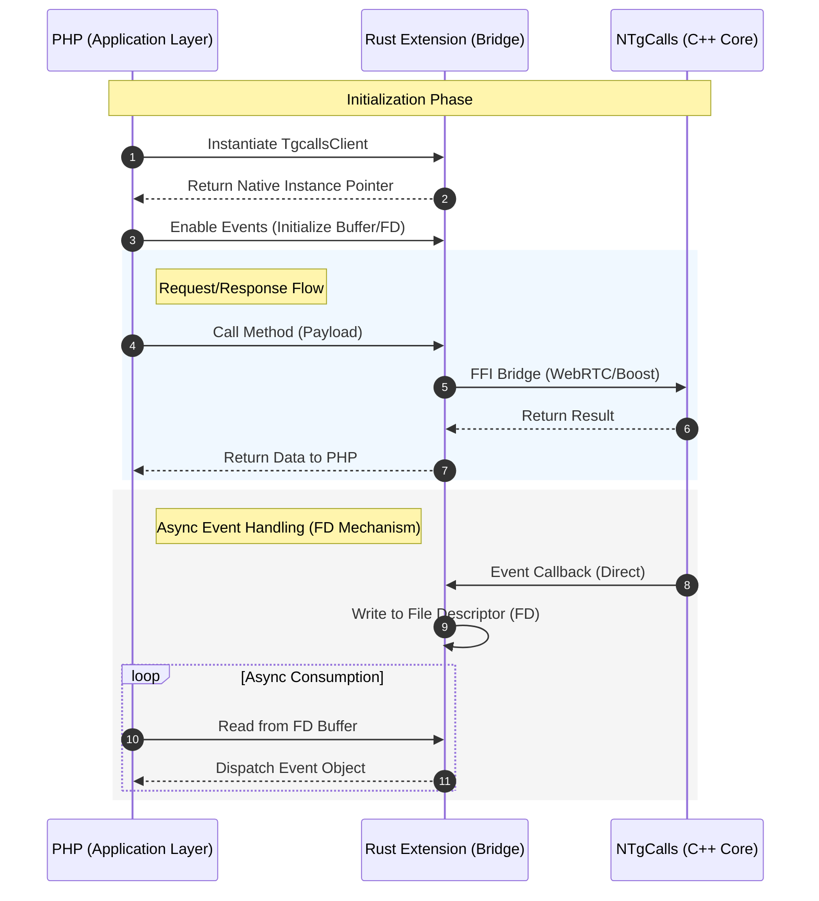

<p align = 'center'>
  
  
  
</p>

<p align = 'center'>
  
</p>

<p align = 'center'>
  <b>⚡ A blazing-fast PHP extension powered by Rust for Telegram voice/video calls ⚡</b>
</p>

<p align = 'center'>
  
  
  
  
  
  
</p>

---

## 🎯 What is PhpTgCalls ?

> **PhpTgCalls** is a native PHP extension built with **Rust** that brings **Telegram voice & video calling** capabilities directly into PHP. It wraps the powerful [NTgCalls](https://github.com/pytgcalls/ntgcalls) C++ library, providing a clean, object-oriented PHP API

It integrates seamlessly with **[LiveProto](https://github.com/TakNone/LiveProto)** — the async, pure-PHP MTProto Telegram client — enabling you to **join group calls, stream audio/video, and handle Telegram VoIP** entirely from PHP

---

## ✨ Features

| Category | Feature |
| :----------: | :---------: |
| 🎙️ **Core** | Join group calls ( voice & video ) |
| 🎥 **Media** | Stream audio/video with H.264, VP8, VP9, AV1, Opus, AAC, MP3 |
| 📺 **Screen** | Screen sharing & presentation mode |
| 🔄 **Async** | Fully asynchronous — built for **Fibers** & **Swoole** |
| 🔐 **Crypto** | DH key exchange, encryption params, signaling |
| 📡 **Events** | Stream, connection, upgrade, frame, and signaling event streams |
| ⚡ **Performance** | Rust-powered native code, minimal overhead |
| 🧩 **Ecosystem** | First-class [LiveProto](https://github.com/TakNone/LiveProto) integration |

---

## 🏗️ Architecture



---

## 📦 Installation

### Prerequisites

- **PHP 8.4+**
- **Rust 1.96.0+**

### From Source

```bash
git clone https://github.com/TakNone/phptgcalls.git
cd phptgcalls
cd ext

sudo bash install.sh
```

### Verify Installation

```bash
php --ri phptgcalls
```

### Composer

> [!NOTE]
> Automated Rust extension installation and php.ini configuration :

```bash
composer require taknone/phptgcalls
```

> [!NOTE]
> To install the framework package without triggering the automatic extension installation script, use :

```bash
composer require taknone/phptgcalls --no-scripts
```

---

## 🚀 Quick Start

```php
<?php

require_once 'vendor/autoload.php';

use Tak\Liveproto\Utils\Settings;

use Tak\Liveproto\Network\Client;

use Tak\Tgcalls\Driver;

use Tak\Asyncio\Loop;

Loop::queue(static function() : void {
	try {
		$settings = new Settings();
		$settings->setApiId(21724);
		$settings->setApiHash('3e0cb5efcd52300aec5994fdfc5bdc16');
		$client = new Client('phptgcalls','sqlite',$settings);
		$client->start(false);

		$tgcalls = new Driver(client : $client,chat_id : -100123456789);
		$params_json = $tgcalls->create();

		// Both MTProto and TgCalls clients are ready to use... //
	} finally {
		$client->stop();
	}
});

Loop::run();

?>
```

---

## 🔗 Integration with LiveProto

TgCalls is designed to work hand-in-hand with **[LiveProto](https://github.com/TakNone/LiveProto)** :

| LiveProto | TgCalls |
| :-----------: | :---------: |
| MTProto connection & auth | VoIP call management |
| `phone.joinGroupCall()` | `TgcallsClient.create()` + `connect()` |
| DH config retrieval | `TgcallsClient.init_exchange()` |
| Signaling relay | `TgcallsClient.send_signaling_data()` |

> [!IMPORTANT]
> **LiveProto** handles the MTProto layer ( Telegram API ), while **TgCalls** handles the WebRTC/VoIP layer. Together, they provide a complete Telegram calling solution in PHP

---

## 🧪 Examples

* Explore the [`examples/`](examples/) directory

---

## 🤝 Contributing

We love contributions ! Here's how to get started :

1. **Fork** this repository
2. **Create** a feature branch : `git checkout -b feature/amazing-feature`
3. **Commit** your changes : `git commit -m 'Add amazing feature'`
4. **Push** to the branch : `git push origin feature/amazing-feature`
5. **Open** a Pull Request

---

## 💬 Community

Join the **phptgcalls** ecosystem :

| Platform | Link |
|----------|------|
| 💬 **Telegram Chat** | [PhpTgCallsChat](https://t.me/phptgcalls) |
| 🐛 **Bug Reports** | [GitHub Issues](https://github.com/TakNone/phptgcalls/issues) |

---

## 📜 License

This project is licensed under the **[MIT License](LICENSE)**